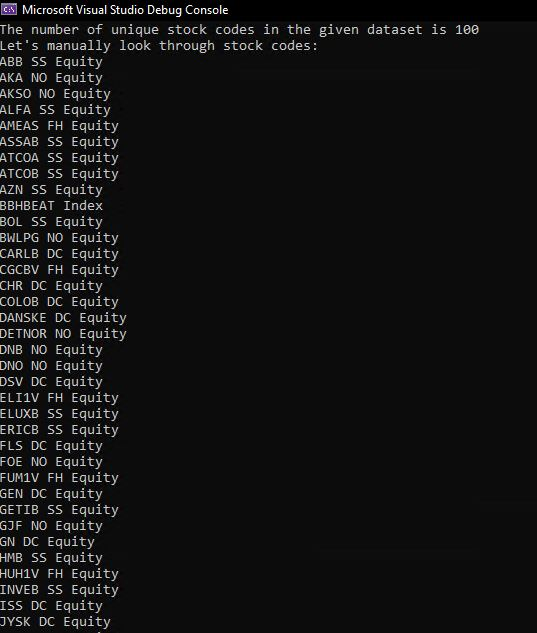

# Assessment-by-Itarle

We were provided by a dataset (*"scandi.csv"*) consisting from 100 Scandinavian blue chip stocks and their trades over 4 days. The task is to conduct data analysis on the given data and answer the questions.

Please refer to "*Source.cpp*" file for more details of used functions. Also, the complete answers to the questions are presented in the ```answers.xlsx``` file on stock-by-stock basis.

---
## Pre-processing of dataset
Before analysing and answering questions, we should make sure that our dataset is consistent and without any misalignments.

After reading a csv file via ```readCSV()``` function, we should check the stock codes with ```checkStockCodes()``` function. This supposed to return around 100 unique stock codes as it was specified in a task.

After running ```checkStockCodes()```, we confirm that the dataset contains 100 unique stocks.



However, there are a number of specification that we were instructed of.
1) Auction trades were filtered out by ```isnotAuction()``` function
    - however, we are including "XT" or empty condition codes.  
2) We should consider no trading periods as it might introduce large time gaps.
    - IQD was used to detect outliers. For both time between trades and time between tick changes, we specified a threshold value (calculated via Median and Interquartile Deviation Method), and any value above this threshold were removed from analysis. Because it was no trading periods.

3) I believe that it might be better to sort out the given data in terms of date because this will make sure that two consecutive trades are calculated.
    - Even though most of the data were presented in ascending time order, I decided that it would necessary to sort these values to make sure that these are consecutive trades.
    - In a trade-off between speed and accuracy, I chose an accuracy as this type of post-analysis might consider accuracy as more important factor.


---

## Question 1: mean time between trades

During calculation of mean time between trades by ```meanTimeBetweenTrades()``` function:
1) Outliers were removed by IQD method
2) Every time we make sure that a trade was executed by checking trade volume (which has to be more than 0)

Referring to the results, we could see that the average trading time for the given stocks ranges between **0-2 seconds**. To explain stocks with **0 sec** mean trading time, it might be due to extra removal of outliers which might lead to removal of some valid numbers too. However, calculations <ins>without removal of outliers</ins> resulted in outputs close to 0 too. Therefore, this leads to overall finding that the mean time between trades for almost all stocks is close to 0.

This clearly shows high liquidity of these securities which might be a positive signal.


---
## Question 2: median time between trades
As median is a figure in the middle of sorted data, we will not need any outlier removals. This was calculated by ```medianTimeBetweenTrades``` function.

Again, for most of the stocks, the findings show a median time between trades ranging from **0-1 seconds**, while *BBHBEAT Index* shows the highest mean and median with value 1. Referring to both mean and median of time between trades for the given stocks, we can confirm that the data is having *symmetrical distribution*. Therefore, we can now be more confident in our assumption that time between trades is small for most cases. And this will mean <ins>*high liquidity*</ins> of these securities.

---
## Question 5: longest time between trades
Results show that the longest times between trades are in a range of **0-3 seconds**.

We used IQD method to remove outliers in our calculation, which might have resulted in removal of valid figures. However, by this approach we made sure to remove all invalid figures, therefore, we are putting more stress on precision rather than recall.


---
## Question 3: mean time between tick changes
Tick is a measure of minimum upward or downward movement in the price of a security. In detail, we define two types of tick as a movement indicator - uptick and downtick.
- Uptick indicates a trade where the transaction has occurred at a price higher than the previous transaction.
- Downtick indicates a transaction that has occurred at a lower price.

In other words, we can calculate a slope between two consecutive trading points. If the slope is positive, then it is uptick. In opposite case, it is a downtick. 

Calculation of mean tick change times showed numbers in range of **1-72 seconds**. The minimum tick change mean time had *GETIB SS EQUITY* with value *1 sec*, while the maximum was *72 secs* for *TLS1V FH EQUITY*. The only exception might be *BBHBEAT Index* which didn't had any price fluctuations during the given dataset. 

---

## Question 4: median time between tick changes
Procedure would be similar to the previous question. However, we would be saving time differences between tick changes and outputing a middle value after sorting the time differences.

In this part, it showed a similar pattern with values between **0-11 seconds**. Therefore, we can conclude that time between tick changes follow the *positively skewed distribution*.

Frequent tick changes might mean *high volatility* of the securities. While these might be risky stocks, it also introduces an opportunity for potential profits.

---

## Question 6: longest time between tick changes
Results show that the longest times between trades are in a range of **10-592 seconds**.

---

## Question 7: mean bid ask spread
As the given stocks are probably traded in a competitive market, we expect average bid-ask spread to of a minimal value. And our assumption was confirmed by calculations as mean bid-ask spread ranges between 0.0055 (*REC NO Equity*) and 13.326 (*MAERSKB DC Equity*) dollar per stock. 

---

## Question 8: median bid ask spread
As the given stocks are probably traded in a competitive market, we expect median bid-ask spread to of a minimal value too. And our assumption was confirmed by calculations as median bid-ask spread ranges between 0.01 and 4 dollar per stock. 

---

## Question 9: round number effect
As there is no need to sort the calculated figures (as in case of time differences or bid-ask spread), we could refer to a csv file as a database. Every time a new line of data would be read and used in our calculations. For more details, please refer to ```roundNumberEffect``` method.

As you could refer to the numbers in ```answer.xlsx``` (at row #105), we can see that in almost **20%** of the cases **number 0** appears to be an ending digit of trade price or trade volume. This is 2-3 times more often than the other digits, except **number 5** who is showing slightly less frequency. 

Therefore, we can conclude that <ins>there exist an effect of round numbers</ins> in the given dataset. Because exactly **number 0** and **number 5** is being used several times more frequently as a last digit of input.